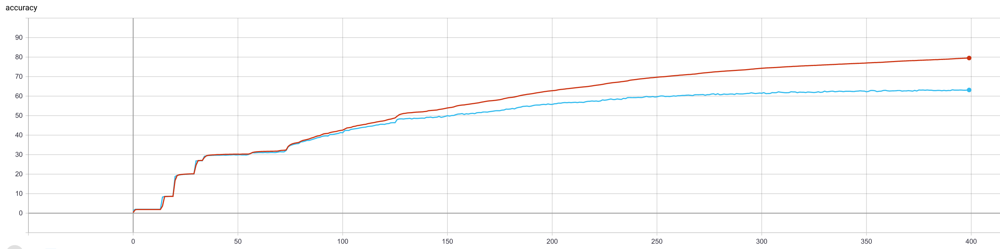
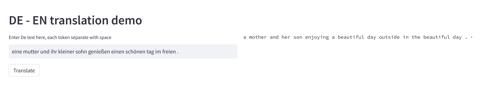

# Attention is all you need: A Pytorch Implementation

This is my PyTorch reimplementation of the Transformer model in "[Attention is All You Need](https://arxiv.org/abs/1706.03762)" (Ashish Vaswani, Noam Shazeer, Niki Parmar, Jakob Uszkoreit, Llion Jones, Aidan N. Gomez, Lukasz Kaiser, Illia Polosukhin, arxiv, 2017).

> The official Tensorflow Implementation can be found in: [tensorflow/tensor2tensor](https://github.com/tensorflow/tensor2tensor/blob/master/tensor2tensor/models/transformer.py).

> To learn more about self-attention mechanism, you could read "[A Structured Self-attentive Sentence Embedding](https://arxiv.org/abs/1703.03130)".

<p align="center">

</p>


The project support training and translation with trained model now with web ui.

If there is any suggestion or error, feel free to fire an issue to let me know. :)


# Usage

## WMT'16 Multimodal Translation: de-en

An example of training for the WMT'16 Multimodal Translation task (http://www.statmt.org/wmt16/multimodal-task.html).

### 0) Download the spacy language model.
```bash
# conda install -c conda-forge spacy 
python -m spacy download en
python -m spacy download de
```

### 1) Preprocess the data with torchtext and spacy.
```bash
python preprocess.py -lang_src de -lang_trg en -share_vocab -save_data m30k_deen_shr.pkl
```

### 2) Train the model
```bash
python train.py -data_pkl m30k_deen_shr.pkl -embs_share_weight -label_smoothing -output_dir out/my_pipeline_w_fixed_sdpa -b 256 -warmup 128000 -epoch 400 -scale_emb_or_prj none -use_tb
```


#### Training - accuracy curves



### 3) Inference
* train your own model or download one from [Google drive](https://drive.google.com/file/d/1g2ByzZkfGy03EI3g4JwjkTuMAH7Vg99q/view?usp=share_link) and put it into `weights` folder.
* run web ui and test the model with your own text
```angular2html
streamlit run demo_web.py
```
#### Web ui - demo



 
  

# Acknowledgement
- The code was borrowed from this awesome repo (https://github.com/jadore801120/attention-is-all-you-need-pytorch).
I reimplement the model with an educational purpose.
